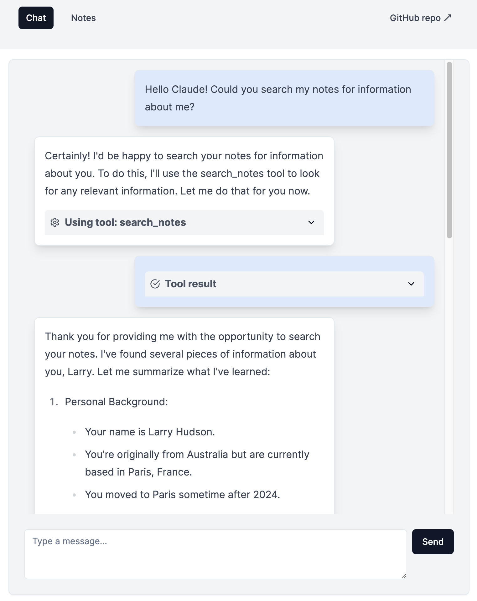

# Claude 3.5 Sonnet chatbot with custom tools



This project is a [Next.js](https://nextjs.org/) application that demonstrates how to add custom tools to [Anthropic's Claude 3.5 Sonnet model](https://www.anthropic.com/news/claude-3-5-sonnet) to give it extra capabilities.

Key features include:
- Note-taking with semantic search capabilities using the [Weaviate vector database](https://weaviate.io/)
- Web search functionality using the [Serper API](https://serper.dev/)
- Uses server sent events to stream the large language model's responses to the frontend while the message is generating.

## Video walkthrough

[](https://www.youtube.com/watch?v=3EqjKtwCM_E)

You can see a video walkthrough of this project here. In the video, I give a high-level overview of how tool use works with the Anthropic API.


## Related tutorial - how to extend Claude's capabilities with custom tools

I have also created a video tutorial showing how to define custom tools and use them with Anthropic's TypeScript client. You can see the [video here](https://www.youtube.com/watch?v=C-fyjyv7xpE) and the [accompanying code examples here](https://github.com/larryhudson/claude-custom-tools-typescript).

## Prerequisites

Before you begin, ensure you have the following installed:
- Node.js 
- Docker - if you are using macOS, I recommend [OrbStack](https://orbstack.dev/) as a lightweight alternative to Docker Desktop.

You will also need an [Anthropic API](https://console.anthropic.com/) account for the chatbot interface and an [OpenAI API](https://platform.openai.com/) account for the Weaviate database's embeddings.

If you would like to use the 'search_web_with_google' tool, you will also need an account with the [Serper API](https://serper.dev/).

## Setup instructions

1. Clone the repository:
   ```
   git clone https://github.com/larryhudson/claude-custom-tools-demo.git
   cd claude-custom-tools-demo
   ```

2. Install dependencies:
   ```
   npm install
   ```

3. Set up environment variables: Duplicate the `.env.local.sample` file in the root project directory to `.env.local` and fill in your API keys.

4. Start the Weaviate backend:
   ```
   docker-compose --env-file=.env.local up -d
   ```

5. Run the Weaviate initialisation script to create the 'Note' collection. This runs the `scripts/init.ts` script:
```
npm run init
```

6. Run the development server:
   ```
   npm run dev
   ```

7. Open your browser and navigate to `http://localhost:3000` to see the application running.

## How to use

- Use the chat interface to interact with the AI assistant.
- The assistant can perform web searches, extract YouTube transcripts, find and fetch RSS feeds, and manage notes.
- To manage notes, navigate to the Notes page where you can view, search, edit, and delete notes.

## Project structure

- `src/components/ChatComponent.tsx`: React component for the chat interface
- `src/app/api/stream/route.ts`: API route handler for the Claude AI integration
- `src/app/notes/page.tsx`: Page for managing notes
- `docker-compose.yml`: Configuration for the Weaviate backend

## License

This project is licensed under the MIT License.
